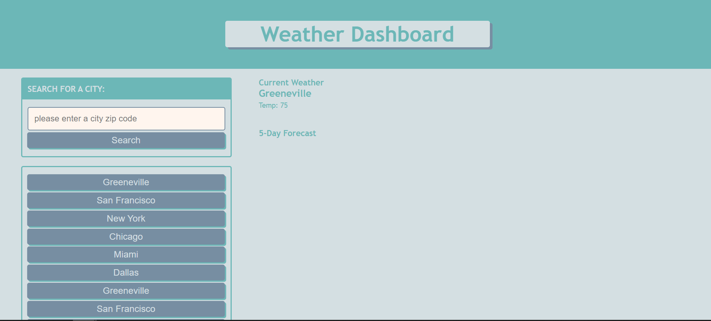

# **Weather Dashboard**
 
## **The Repository**
#### GitHub: https://github.com/loriful/rainy-day-people

## **Deployment**
#### https://loriful.github.io/rainy-day-people

## **Description**
Weather dashboard using Open Weather One Call API.  Takes a user provided zip code and returns the weather for that city.  Stores the most recent cities in local storage and uses them as a starter for the next launch.

Practice: 
  - HTML
  - CSS
  - JavaScript
  - Third Party APIs
  - localStorage
  - Complete Challenge 06

  
## **Table of Contents**
- [Description](#description)
- [Installation](#installation)
- [Usage](#usage)
- [Questions](#questions)
- [Resources](#resources)

## **The Site View**

   
  </b>
  </b>

## **Installation**
- None required

## **Usage**
- Launch from browser at above link

## **Resources**
- Utilizes OpenWeather One Call API - https://openweathermap.org/api/one-call-api to retrieve weather data for cities.

## **Questions**
### Github Profile:  https://github.com/loriful

### You may contact tiptonica@gmail.com with any questions related to this repository.

## **Credits**

tiptonica@gmail.com

